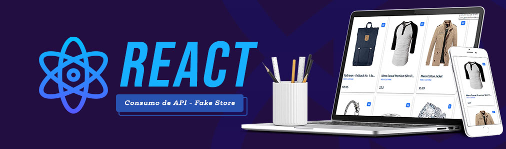

<p align="center">
    
    
    
    
    
    
    
</p>

# 📄 Consumo de API com React

## 📢 Descrição do Projeto

### 🎯 Objetivo

<p align="left">
    O objetivo deste projeto é a construção de um componente React que possa ser utilizado para uma loja virtual e para isso foi utilizado a API Fake store.
<p align="left">
    <em>O projeto tem caráter experimental e visa a prática do conhecimento.</em>
</p>

### 🛠️ Ferramentas utilizadas

<p>
    
</p>
<ul>
    <li><b>Visual Studio Code:</b> Ambiente de Desenvolvimento Integrado (IDE).</li>
    <li><b>HTML:</b> Estruturação da página.</li>
    <li><b>CSS:</b> Estilização e diagramação do conteúdo.</li>
    <li><b>JavaScript:</b> Linguagem de programação principal.</li>
    <li><b>React:</b> Framework principal do projeto.</li>
    <li><b>Git:</b> Controle de versão.</li>
    <li><b>Github:</b> Repositório remoto.</li>
</ul>

### ✒️ UI Design

Para a interface do componente foi utilizado as bibliotecas <strong>Primereact</strong>, <strong>Primeflex</strong> e <strong>Primeicons</strong>.

## 💻 Pré-requisitos

Antes de começar, verifique se você atendeu aos seguintes requisitos:

- Você tem uma máquina `<Windows / Linux / Mac>` ou um smartphone `<Android / iOS>`.
- Você tem a versão mais recente de um dos principais navegadores `<Chrome / Firefox / Edge / Opera>` instalada.

## :atom: Dependências
<li><strong>axios</strong>: 1.7.7</li>
<li><strong>primeflex</strong>: 3.3.1</li>
<li><strong>primeicons</strong>: 7.0.0</li>
<li><strong>primereact</strong>: 10.8.4</li>
<li><strong>react</strong>: 18.3.1</li>
<li><strong>react-dom</strong>: 18.3.1</li>
<li><strong>react-router-dom</strong>: 6.27.0</li>
<li><strong>styled-components</strong>: 6.1.13</li>

## ☕ Usando o projeto

<ul>
    <li>Etapa 1: baixe os arquivos.</li>
    <li>Etapa 2: Execute o comando no terminal:</li>
</ul>

```
npm run dev
```
<ul>
    <li>Etapa 3: clique no link gerado.</li>
</ul>